<div align="center">

# 📊 Financial Researcher AI.

**AI-Powered Financial Analysis & Research Reports**

[](https://python.org)
[](https://crewai.com)
[](https://streamlit.io)
[](LICENSE)

*Generate comprehensive financial research reports using a team of specialized AI agents*

[Features](#-features) • [Quick Start](#-quick-start) • [Documentation](#-documentation) • [Architecture](#-architecture)

---


</div>

## ✨ Features

- 🤖 **Multi-Agent System** — Four specialized AI agents collaborating on research tasks
- 🔍 **Comprehensive Analysis** — Company overview, financial metrics, risk assessment, market position
- 🌐 **Multiple LLM Providers** — Support for Ollama (local), OpenAI, Anthropic, and Groq
- 🎨 **Modern UI** — Beautiful glassmorphism design with Streamlit
- 📄 **Export Reports** — Download professional research reports in Markdown format
- ⚡ **Real-time Progress** — Track research progress as agents complete tasks

## 🚀 Quick Start

### Prerequisites

- **Python 3.13+**
- **[uv](https://github.com/astral-sh/uv)** package manager (recommended) or pip
- **[Ollama](https://ollama.ai)** (for local models) or API key for cloud providers
- **[Serper API Key](https://serper.dev)** for web search capabilities

### Installation

```bash
# Clone the repository
git clone https://github.com/FamilOrujov/Financial-Researcher-AI.git
cd Financial-Researcher-AI

# Install dependencies using uv (recommended)
uv sync

# Or using pip
pip install -e .
```

### Environment Setup

Create a `.env` file in the project root:

```env
# Required for web search
SERPER_API_KEY=your_serper_api_key

# Optional: Cloud LLM providers (only if not using Ollama)
OPENAI_API_KEY=your_openai_key
ANTHROPIC_API_KEY=your_anthropic_key
GROQ_API_KEY=your_groq_key
```

### Running the Application

```bash
# Start Ollama (if using local models)
ollama serve

# Pull a recommended model
ollama pull llama3.1:8b

# Launch the Streamlit app
cd src
uv run streamlit run app.py
```

The app will open at `http://localhost:8501`

## 📖 Documentation

### Supported LLM Providers

| Provider | Models | Type | Notes |
|----------|--------|------|-------|
| **Ollama** | llama3.1:8b, mistral, codellama, etc. | Local | Free, requires Ollama installed |
| **OpenAI** | gpt-4o, gpt-4o-mini, gpt-4-turbo, gpt-3.5-turbo | Cloud | Requires API key |
| **Anthropic** | claude-3-5-sonnet, claude-3-opus, claude-3-haiku | Cloud | Requires API key |
| **Groq** | llama-3.3-70b-versatile, llama-3.1-8b-instant, mixtral-8x7b | Cloud | Fast inference, requires API key |

### Model Recommendations

| Use Case | Recommended Model | Notes |
|----------|-------------------|-------|
| **Best Quality** | `gpt-4o` or `claude-3-5-sonnet` | Most comprehensive analysis |
| **Local/Free** | `llama3.1:8b` | Good balance of quality and speed |
| **Budget** | `gpt-4o-mini` or `groq/llama-3.1-8b-instant` | Fast and affordable |

### Output Files

Research generates the following files in `src/output/`:

| File | Description |
|------|-------------|
| `financial_research.md` | Initial company research and news |
| `research_strategy.md` | Key areas and metrics to analyze |
| `company_analysis.md` | Business model and segments analysis |
| `financial_data_analysis.md` | Financial ratios and performance |
| `risk_assessment.md` | Key risks and risk factors |
| `market_analysis.md` | Market position and competitive landscape |
| `draft_report.md` | Compiled draft of findings |
| `report.md` | **Final comprehensive research report** |

## 🏗 Architecture

### AI Agent Team

```
┌─────────────────────────────────────────────────────────────────┐
│                    FINANCIAL RESEARCHER AI                       │
├─────────────────────────────────────────────────────────────────┤
│                                                                  │
│  ┌──────────────────┐    ┌──────────────────┐                   │
│  │  🔬 Head of      │    │  📊 Financial    │                   │
│  │     Research     │───▶│     Analyst      │                   │
│  │                  │    │                  │                   │
│  │  • Web Search    │    │  • Financial     │                   │
│  │  • Strategy      │    │    Modeling      │                   │
│  │  • Coordination  │    │  • Valuation     │                   │
│  └──────────────────┘    └────────┬─────────┘                   │
│                                   │                              │
│                                   ▼                              │
│  ┌──────────────────┐    ┌──────────────────┐                   │
│  │  📈 Data         │    │  📝 Report       │                   │
│  │     Analyst      │───▶│     Writer       │                   │
│  │                  │    │                  │                   │
│  │  • Market Data   │    │  • Report        │                   │
│  │  • Trends        │    │    Compilation   │                   │
│  │  • Competitive   │    │  • Professional  │                   │
│  │    Intelligence  │    │    Formatting    │                   │
│  └──────────────────┘    └──────────────────┘                   │
│                                                                  │
└─────────────────────────────────────────────────────────────────┘
```

### Research Workflow

```mermaid
graph TD
    A[🔍 Financial Research] --> B[📋 Research Strategy]
    B --> C[🏢 Company Analysis]
    C --> D[📊 Financial Data Analysis]
    D --> E[⚠️ Risk Assessment]
    E --> F[🌍 Market Analysis]
    F --> G[📝 Draft Report]
    G --> H[✅ Final Report]
```



### Task Pipeline

| # | Task | Agent | Description |
|---|------|-------|-------------|
| 1 | Financial Research | Head of Research | Web search for company info and news |
| 2 | Research Strategy | Head of Research | Outline key areas and metrics |
| 3 | Company Analysis | Financial Analyst | Business model and segments |
| 4 | Financial Data Analysis | Financial Analyst | Key financial metrics |
| 5 | Risk Assessment | Financial Analyst | Identify and analyze risks |
| 6 | Market Analysis | Data Analyst | Market position and competition |
| 7 | Draft Report | Data Analyst | Compile findings |
| 8 | Final Report | Report Writer | Professional formatted report |

## 📁 Project Structure

```
Financial-Researcher-AI/
├── src/
│   ├── app.py              # Streamlit web application
│   ├── crew.py             # CrewAI agents and tasks definition
│   ├── main.py             # CLI entry point
│   ├── config/
│   │   ├── agents.yaml     # Agent configurations
│   │   └── tasks.yaml      # Task definitions
│   └── output/             # Generated reports (gitignored)
├── pyproject.toml          # Project dependencies
├── uv.lock                 # Locked dependencies
├── .env                    # Environment variables (create this)
└── README.md
```

## 🔧 Configuration

### Agent Configuration (`src/config/agents.yaml`)

```yaml
head_of_research:
  role: Head of Research
  goal: Lead and coordinate comprehensive financial research
  backstory: Seasoned financial research leader with 15+ years experience
  llm: ollama/llama3.1:8b

financial_analyst:
  role: Financial Analyst
  goal: Analyze financial statements, ratios, and key metrics
  backstory: Expert financial analyst with deep expertise in valuation
  llm: ollama/llama3.1:8b
```

### Task Configuration (`src/config/tasks.yaml`)

Tasks define the workflow and expected outputs. Each task specifies:
- Description of what to accomplish
- Expected output format
- Context dependencies from previous tasks

## 🛠 Development

### Running from CLI

```bash
# Run research directly without UI
cd src
python crew.py
```

### Customizing Agents

Edit `src/config/agents.yaml` to modify agent roles, goals, or backstories.

### Adding New Tasks

Edit `src/config/tasks.yaml` and update `src/crew.py` to add new research tasks.

## 📋 Final Report Structure

The generated research report includes:

1. **Executive Summary**
   - Key findings overview
   - Investment thesis
   - Target price and recommendation

2. **Company Overview**
   - Business description and history
   - Products and services
   - Revenue segments
   - Management assessment

3. **Financial Analysis**
   - Revenue and earnings trends
   - Profitability metrics
   - Balance sheet strength
   - Cash flow analysis

4. **Market & Competitive Analysis**
   - Industry overview
   - Market size and growth
   - Competitive positioning
   - Key competitors

5. **Risk Assessment**
   - Financial risks
   - Operational risks
   - Market risks
   - Regulatory risks

6. **Investment Recommendation**
   - Buy/Hold/Sell recommendation
   - Key catalysts
   - Price target methodology


---

> ⚠️ **Disclaimer:** This AI system is designed for informational purposes only and does not constitute professional financial advice. The generated analyses and recommendations may contain inaccuracies or errors. Always consult a qualified financial advisor before making investment decisions.

